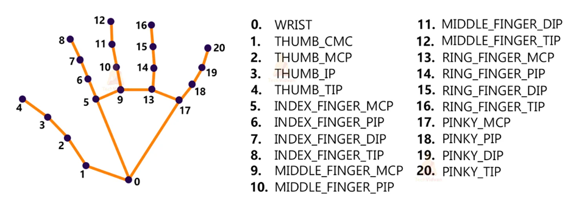

# KIFreundeWNOE
  
Hand Gesture Recognition

  
Problemstellung

Wir wollten eine Anwendung implementieren, mit deren Hilfe verschiedenen Handgesten erkannt werden können.

 

  
Lösungsansatz

Um dies zu erreichen wollten wir TensorFlow und OpenCV nutzen. Es sollte ein TensorFlow-Model trainiert werden, das viele Bilder von unterschiedlichen Handgesten eingespielt werden, denen die verschiedenen Bedeutungen zugeordnet werden. Um dies zu vereinfachen haben wir ein Python Script geschrieben, welches automatisch Fotos von den Gesten macht und mit diesem sollte das Model trainiert werden. Nachdem die Fotos zugeordnet wurden und das Model trainiert wurde sollte mit OpenCV die tatsächliche Gestenerkennung implementiert werden. Bei dem Training eines eigenen Models kam es allerdings zu Problemen, weshalb wir für das Model ein vortrainiertes Keras-Model verwenden.

Außerdem haben wir ein Python-Script geschrieben, welches mithilfe von OpenCV Positionen der Finger in ein Array speichert. Basierend auf diesen Positionen werden Gesten definiert, welche von dem Programm erkannt werden.

 

Hier sieht man die einzelnen Punkte auf einer Hand welche im Array gespeichert werden

  
Keras-Model

Ein Keras-Modell ist ein Modell, das mit der Keras-Bibliothek erstellt wurde, die eine Open-Source-Neural-Netzwerk-Bibliothek ist. Keras bietet eine einfache und intuitive Schnittstelle zum Erstellen von neuronalen Netzwerken und ist aufgrund seiner Flexibilität und Leistungsfähigkeit bei der Verarbeitung großer Datenmengen sehr beliebt.

  
OpenCV

OpenCV steht für "Open Source Computer Vision Library" und ist eine Open-Source-Bibliothek für Computer Vision und Bildverarbeitung. Sie wurde für den Einsatz in Echtzeit-Anwendungen entwickelt und bietet eine Vielzahl von Funktionen für die Verarbeitung von Bildern und Videos.

 

  
TensorFlow

TensorFlow ist eine Open-Source-Softwarebibliothek für maschinelles Lernen, die von Google entwickelt wurde. Sie wird für die Erstellung und Ausführung von Deep-Learning-Modellen verwendet und bietet eine leistungsstarke und flexible Plattform für die Umsetzung von künstlicher Intelligenz in verschiedenen Anwendungen.